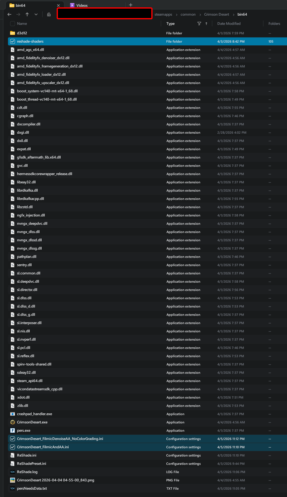
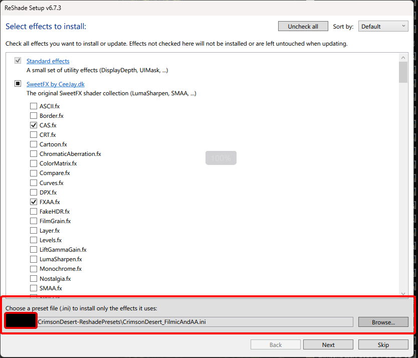
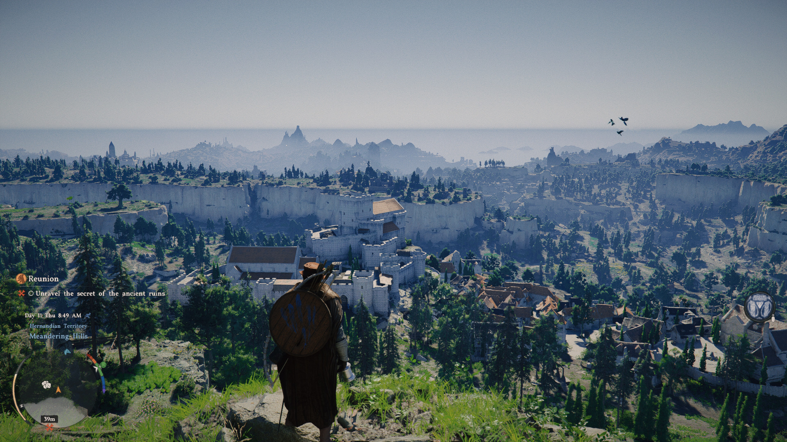
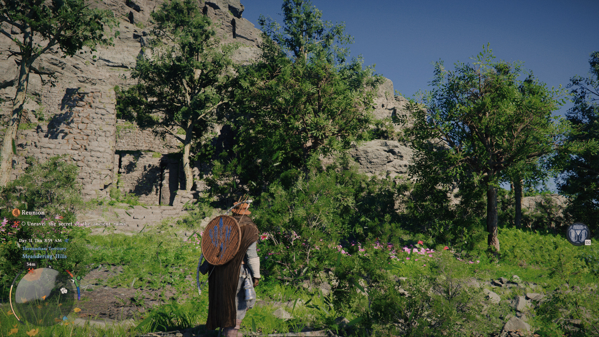
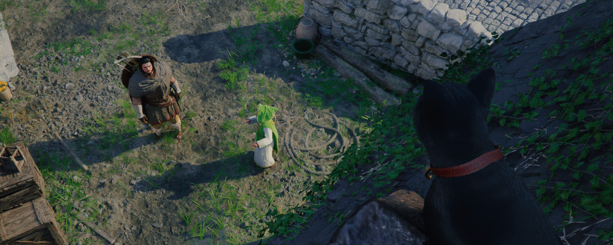
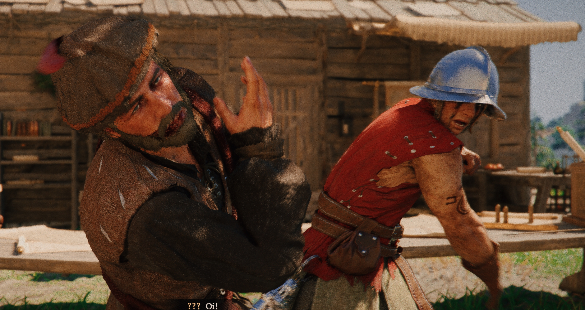

# Crimson Desert: Reshade Presets

I made a basic one to reduce the noise artifacts from the game using various effects including negative/positive film grain in filmdeck. Makes the noise/warping/banding the game naturally has less distracting.
The other uses pandafx and filmdeck to add additional some color grading for a cinematic look.

## Instructions

1. Download the latest version of Reshade from the official website: https://reshade.me/
2. Install reshade to Homura Hime app install location or [ShaderGlass](https://github.com/mausimus/ShaderGlass)
   * 
3. Drag and drop desired presets and dependent reshade-shaders directory to installed reshade directory
   * 
4. If you don't know what shaders to install you can simply rerun reshade and tell it to install for your desired preset:
   * 

## Gallery

